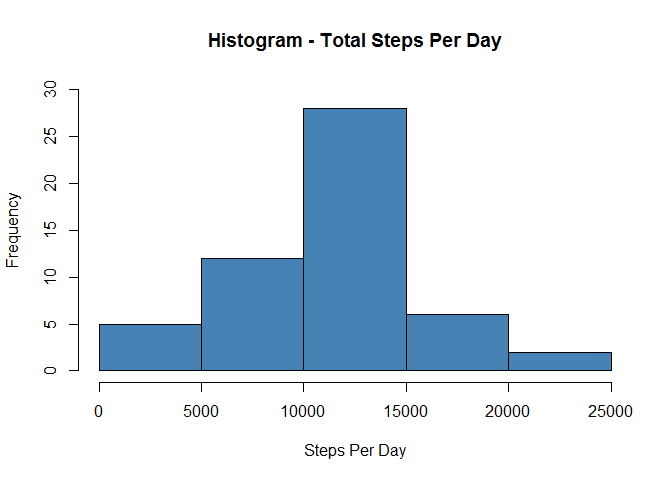
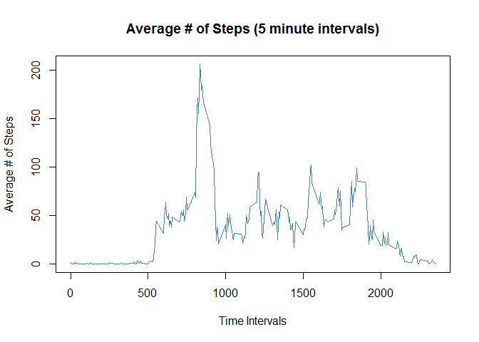
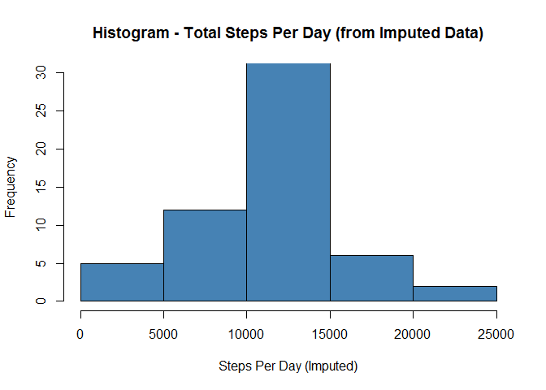
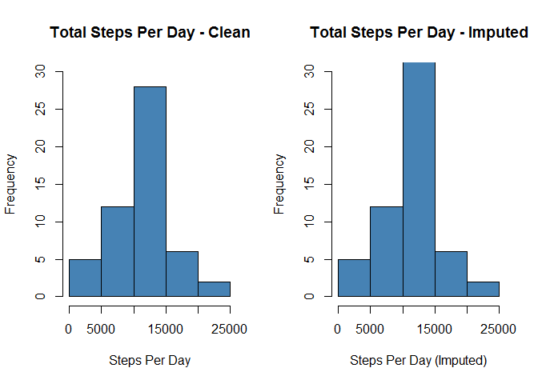
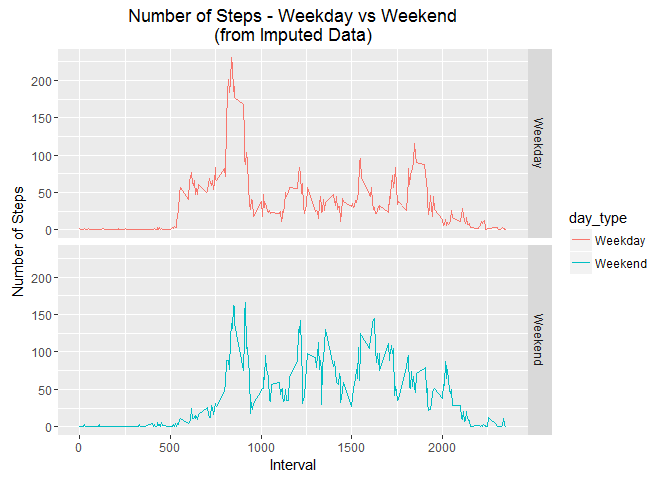

# Reproducible Research: Peer Assment 1
Tim Terry  
April 1, 2016  

## Loading and Pre-Processing the Data
* Load the data
* Transform the data into a format suitable for analysis


```r
#
# Load the "activity.csv" dataset to working data frame
#

setwd("C:/Users/tterry/Documents")

act <- read.csv("activity.csv")
```

Exploratory review of the data finds NA values in "steps"


```r
summary(act$steps)
```

```
##    Min. 1st Qu.  Median    Mean 3rd Qu.    Max.    NA's 
##    0.00    0.00    0.00   37.38   12.00  806.00    2304
```


```r
#
# Remove NA values from working data frame and create a clean data frame
#

act_clean <- act[complete.cases(act), ]
```

## What is the mean total number of steps taken per day?
* Calculate the total number of steps taken per day
* Make a histogram of the total number of steps taken each day
* Calculate and report the mean and median of the total number of steps taken per day


```r
#
# Calculate the total number of steps take per day
#

steps_day <- aggregate(steps ~ date, act_clean, sum)
```


```r
#
# Create histogram of total number of steps taken each day
#

hist(steps_day$steps, 
     main = "Histogram - Total Steps Per Day", 
     xlab = "Steps Per Day", 
     col = "steelblue", 
     ylim = c(0, 30)
     )
```

<!-- -->


```r
#
# Calculate the mean and median values for steps taken per day
#

mean(steps_day$steps)
```

```
## [1] 10766.19
```

```r
median(steps_day$steps)
```

```
## [1] 10765
```

## What is the average daily activity patterns?
* Make a time series plot of the 5 minute interval (x-axis) and the average number of steps taken, averaged across all days (y-axis)
* Which 5 minute interval, on average across all days, contains the maximum number of steps?


```r
#
# Create a data frame with the average number of steps taken for each interval
#

avg_steps_int <- aggregate(steps ~ interval, act_clean, mean)
```


```r
#
# Generate a time series plot with interval on the x-axis and average number of steps on y-axis
#

plot(avg_steps_int$interval, 
     avg_steps_int$steps,
     type = "l",
     col = "steelblue",
     main = "Average # of Steps (5 minute intervals)",
     xlab = "Time Intervals",
     ylab = "Average # of Steps"
     ) 
```

<!-- -->


```r
#
# Determine which 5 minute interval contains the maximum number of steps
#

avg_steps_int[which.max(avg_steps_int$steps), ]$interval
```

```
## [1] 835
```

## Imputing missing values
* Calculate and report the total number of missing values in the dataset
* Devise a strategy for filling the missing values in the dataset
* Create a new dataset that is equal to the original dataset but with the missing data filled in
* Make a histogram of the total number of steps taken each day
* Calculate and report the mean and median total number of steps
* Do these values differ from the estimates from the original dataset?
* What is the impact of imputing missing data on the estimates of the total daily number of steps?


```r
#
# Determine the total number of missing values in the original data frame
#

sum(is.na(act))
```

```
## [1] 2304
```


```r
#
# Create a new data frame that will have the imputed values loaded to replace NA values
#

act_imp <- act
```


```r
#
# Loop through the original data frame and replace NA values with the average values for the respective interval
#

for (i in 1:nrow(act_imp)) {
    if(is.na(act_imp$steps[i])) {
        imp_val <- avg_steps_int$steps[which(avg_steps_int$interval == act_imp$interval[i])]
        act_imp$steps[i] <- imp_val 
    }
}
```


```r
#
# Aggregate total steps per day using new data frame with imputed values
#

steps_day_imp <- aggregate(steps ~ date, act_imp, sum)
```


```r
#
# Create histogram of total number of steps taken each day using new data frame with imputed values
#

hist(steps_day_imp$steps, 
     main = "Histogram - Total Steps Per Day (from Imputed Data)", 
     xlab = "Steps Per Day (Imputed)", 
     col = "steelblue", 
     ylim = c(0, 30)
     )
```

<!-- -->


```r
#
# Calculate the mean and median values for total number of steps per day
# using new data frame with imputed values
#

mean(steps_day_imp$steps)
```

```
## [1] 10766.19
```

```r
median(steps_day_imp$steps)
```

```
## [1] 10766.19
```


```r
#
# Compare histograms of the clean data against the imputed data
#

par(mfrow = c(1,2))

hist(steps_day$steps, 
     main = "Total Steps Per Day - Clean", 
     xlab = "Steps Per Day", 
     col = "steelblue", 
     ylim = c(0, 30)
     )

hist(steps_day_imp$steps, 
     main = "Total Steps Per Day - Imputed", 
     xlab = "Steps Per Day (Imputed)", 
     col = "steelblue", 
     ylim = c(0, 30)
     )
```

<!-- -->

Histogram comparison indicates similar distribution and quantities with the middle range showing a slightly larger value. 

This is to be expected as we added back 2,304 observations with imputed values to the original clean dataset.


```r
#
# Compare means and medians between clean data and imputed data
#

mean(steps_day$steps)
```

```
## [1] 10766.19
```

```r
mean(steps_day_imp$steps)
```

```
## [1] 10766.19
```

```r
median(steps_day$steps)
```

```
## [1] 10765
```

```r
median(steps_day_imp$steps)
```

```
## [1] 10766.19
```

Comparison of means shows no difference. This is to be expected since the method used for imputing values was based on the mean value of the interval.

The median values are slightly different since the median would be expected to be different unless we had a perfect normal distribution of values to start with.

## Are there differences in activity patterns between weekdays and weekends
* Create new factor variable in the imputed dataset with two levels - "weekday" and "weekend" - indicating whether a given date is a weekday or weekend day
* Make a panel plot containing a time series plot of the 5 minute interval (x-axis) and the average number of steps taken, averaged across all weekday or weekend days (y-axis)


```r
#
# Create a new column for type of day using the date field with two values "Weekday" and "Weekend"
#

act_imp['day_type'] <- weekdays(as.Date(act_imp$date))
act_imp$day_type[act_imp$day_type %in% c('Saturday','Sunday') ] <- "Weekend"
act_imp$day_type[act_imp$day_type != "Weekend"] <- "Weekday"
```


```r
#
# Convert the new field to factor for plotting purposes
#

act_imp$day_type <- as.factor(act_imp$day_type)
```


```r
#
# Aggregate the average number of steps by interval for comparison plot
#

steps_day_int_imp <- aggregate(steps ~ interval + day_type, act_imp, mean)
```


```r
#
# Create a panel plot to compare weekday and weekend average number of steps
#

library(ggplot2)

g <- ggplot(steps_day_int_imp, aes(interval, steps))

g + geom_line(stat = "identity", aes(color = day_type)) +
    facet_grid(day_type ~.) +
    labs(y = expression("Number of Steps")) +
    labs(x = "Interval") +
    labs(title = "Number of Steps - Weekday vs Weekend\n(from Imputed Data)")
```

<!-- -->

The weekend average number of steps shows slightly higher values across the majority of time intervals with the exception being between interval 500 and 1,000 where weekday values are quite higher in this range. 

Perhaps a lot of people walk to work?
